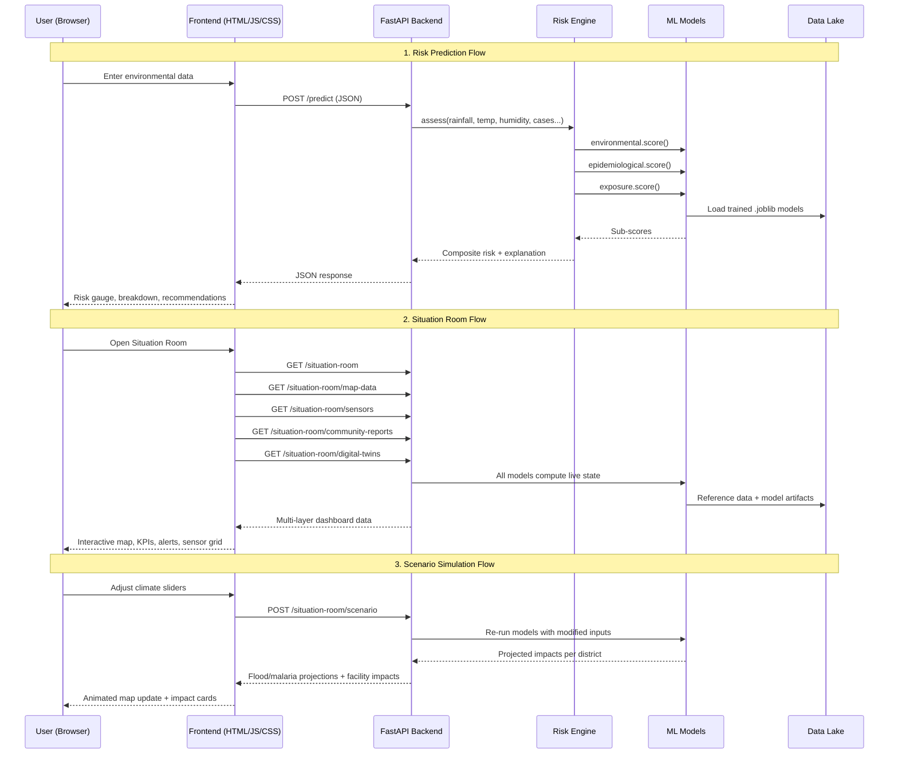

# CHEWS Tech Stack — Architecture Diagram

> **SafetySphere CHEWS v4.0** — Climate-Health Early Warning System for Sierra Leone

---

## Full System Architecture

```mermaid
graph TB
    subgraph CLIENT["🖥️ CLIENT SIDE (Browser)"]
        direction TB

        subgraph PAGES["HTML5 Pages"]
            INDEX["index.html<br/>National Situation Room"]
            EW["early-warning.html<br/>Early Warning Center"]
            STRAT["strategic.html<br/>Strategic Planning"]
            HC["healthcare.html<br/>Healthcare Readiness"]
            POC["point-of-care.html<br/>Point-of-Care Triage"]
            DIST["district.html<br/>District Dashboard"]
            CHW["chw.html<br/>CHW Mobile View"]
            PARTNER["partner.html<br/>Partner Portal"]
            LOGIN["login.html<br/>Role Selection"]
            AI_PAGE["ai-models.html<br/>AI Model Catalog"]
        end

        subgraph JS_MODULES["JavaScript Modules"]
            APP_JS["app.js<br/>Situation Room Engine"]
            EW_JS["early-warning.js<br/>Alert & Forecast Logic"]
            STRAT_JS["strategic.js<br/>Risk Atlas & Carbon"]
            HC_JS["healthcare.js<br/>Disease & Surge"]
            POC_JS["point-of-care.js<br/>Triage Assistant"]
            DIST_JS["district.js<br/>District Analytics"]
            CHW_JS["chw.js<br/>CHW Interface"]
            PARTNER_JS["partner.js<br/>Partner Analytics"]
            AUTH_JS["auth.js<br/>RBAC & Sidebar"]
            THEME_JS["theme.js<br/>Dark/Light Toggle"]
            HEALTH_JS["health-assistant.js<br/>Chat Assistant"]
            AI_JS["ai-models.js<br/>Model Catalog"]
        end

        subgraph STYLING["CSS Design System"]
            CSS["styles.css (147 KB)<br/>Complete Design System<br/>Dark/Light Themes<br/>Responsive Layout<br/>Glassmorphism<br/>Micro-animations"]
        end

        subgraph CDN_LIBS["CDN Libraries"]
            LEAFLET["Leaflet.js 1.9.4<br/>Interactive Maps"]
            LUCIDE["Lucide Icons<br/>Icon System"]
            CARTO["CARTO Dark Tiles<br/>Map Base Layer"]
            FONTS["Google Fonts<br/>Inter · Source Serif 4<br/>JetBrains Mono"]
        end
    end

    subgraph SERVER["⚙️ SERVER SIDE (Python)"]
        direction TB

        subgraph FRAMEWORK["Web Framework"]
            FASTAPI["FastAPI 0.100+<br/>ASGI Application"]
            UVICORN["Uvicorn 0.25+<br/>ASGI Server"]
            PYDANTIC["Pydantic 2.0+<br/>Data Validation"]
            CORS["CORSMiddleware<br/>Cross-Origin Access"]
        end

        subgraph ROUTERS["API Routers"]
            R_STRAT["strategic.py<br/>/strategic/*"]
            R_EW["early_warning.py<br/>/early-warning/*"]
            R_HC["healthcare.py<br/>/healthcare/*"]
            R_POC["point_of_care.py<br/>/poc/*"]
            R_SR["situation_room.py<br/>/situation-room/*"]
        end

        subgraph SERVICES["Service Layer"]
            SVC_ALERT["alert_engine.py<br/>Alert Generation"]
            SVC_FLOOD["flood_dashboard.py<br/>Flood Monitoring"]
            SVC_FORECAST["forecast_engine.py<br/>Forecast Pipeline"]
            SVC_TRIAGE["triage_assistant.py<br/>Clinical Triage"]
            SVC_VULN["vulnerability.py<br/>Vulnerability Scoring"]
        end

        subgraph ML_MODELS["ML / AI Models"]
            ENV_MODEL["environmental.py<br/>Climate Suitability (40%)"]
            EPI_MODEL["epidemiological.py<br/>Disease Spread (40%)"]
            EXP_MODEL["exposure.py<br/>Population Vulnerability (20%)"]
            RISK_ENGINE["risk_engine.py<br/>Composite Risk Aggregator"]
            FLOOD_MODEL["flood_risk.py<br/>GradientBoosting (AUC 0.991)"]
            MAL_MODEL["malaria_predictor.py<br/>GradientBoosting (R² 0.618)"]
            HC_MODEL["healthcare_readiness.py<br/>RandomForest (R² 0.881)"]
            COMM_MODEL["community_reports.py<br/>RandomForest Classifier"]
            HEAT_MODEL["heat_stress.py<br/>WBGT Model"]
            AQ_MODEL["air_quality.py<br/>AQI Health Impact"]
            CARBON_MODEL["carbon_accounting.py<br/>GHG Estimation"]
        end

        subgraph CORE_API["Core API Endpoints"]
            EP_HEALTH["/health<br/>System Health Check"]
            EP_PREDICT["/predict<br/>Multi-layer Risk Assessment"]
            EP_ASK["/ask<br/>Health Assistant"]
        end
    end

    subgraph DATA["📊 DATA LAYER"]
        direction TB

        subgraph DATA_LAKE["4-Stage Data Lake"]
            RAW["01_raw/<br/>DHIS2, MFL, Climate, Community"]
            STAGING["02_staging/<br/>Cleaned & Validated"]
            CURATED["03_curated/<br/>Analysis-Ready"]
            AI_DATA["04_ai/<br/>Features, Training Sets, Models"]
        end

        subgraph REFERENCE["Reference Data"]
            ADMIN["admin_hierarchy.csv<br/>16 Sierra Leone Districts"]
            FLOOD_ZONES["flood_zones.json<br/>23 Flood-prone Communities"]
            FAC_MAP["facility_type_mapping.csv<br/>MFL Type → CHEWS Tier"]
        end

        subgraph SCHEMAS["Data Contracts"]
            S_DHIS2["dhis2_weekly_epi.schema.json"]
            S_MFL["master_facility_list.schema.json"]
            S_COMM["community_reports.schema.json"]
        end

        subgraph TRAINED["Trained Model Artifacts"]
            FLOOD_JOB["flood_model.joblib (242 KB)"]
            MAL_JOB["malaria_model.joblib (142 KB)"]
            HC_JOB["healthcare_model.joblib (2.5 MB)"]
            COMM_JOB["community_model.joblib (75 KB)"]
            ENCODERS["label_encoders.joblib"]
            FEAT_CFG["feature_config.json"]
            TRAIN_META["training_metadata.json"]
        end
    end

    subgraph ML_PIPELINE["🧠 ML TRAINING PIPELINE"]
        TRAIN_ALL["train_all_models.py<br/>End-to-end Training Script"]
        SKLEARN["scikit-learn 1.4+<br/>GBM, RF, LogReg"]
        PANDAS["pandas 2.1+<br/>Data Manipulation"]
        NUMPY["NumPy 1.26+<br/>Numerical Computing"]
        JOBLIB["joblib 1.3+<br/>Model Serialization"]
        MATPLOTLIB["matplotlib 3.8+<br/>Training Visualizations"]
        SEABORN["seaborn 0.13+<br/>Statistical Plots"]
    end

    subgraph DEPLOY["🚀 DEPLOYMENT & INFRASTRUCTURE"]
        VERCEL["Vercel Platform"]
        VERCEL_PY["@vercel/python<br/>Serverless Functions"]
        VERCEL_STATIC["@vercel/static<br/>Static File Hosting"]
        VERCEL_CFG["vercel.json<br/>Route Configuration"]
        GIT["Git<br/>Version Control"]
    end

    subgraph AUTH_SYS["🔐 AUTHENTICATION (Client-Side)"]
        RBAC["Role-Based Access Control"]
        ROLES["4 Roles:<br/>Admin · District · Worker · Partner"]
        STORAGE["localStorage<br/>Session Persistence"]
    end

    subgraph EXTERNAL["🌐 EXTERNAL DATA SOURCES"]
        DHIS2_SRC["DHIS2 API<br/>Health Information System"]
        CHIRPS["CHIRPS/ERA5<br/>Climate Data"]
        WORLDPOP["WorldPop<br/>Population Data"]
        OCHA["OCHA CODs<br/>Admin Boundaries"]
        CHW_SRC["CHW Field Reports<br/>Community Health Workers"]
    end

    %% Client → Server connections
    APP_JS -->|"fetch() REST"| FASTAPI
    EW_JS -->|"fetch() REST"| FASTAPI
    STRAT_JS -->|"fetch() REST"| FASTAPI
    HC_JS -->|"fetch() REST"| FASTAPI
    POC_JS -->|"fetch() REST"| FASTAPI
    HEALTH_JS -->|"fetch() REST"| FASTAPI

    %% Framework internal
    FASTAPI --> ROUTERS
    FASTAPI --> CORE_API
    FASTAPI --> CORS
    UVICORN --> FASTAPI

    %% Routers → Services
    R_EW --> SVC_ALERT
    R_EW --> SVC_FORECAST
    R_SR --> SVC_FLOOD
    R_HC --> SVC_TRIAGE
    R_HC --> SVC_VULN

    %% Services & Routers → Models
    CORE_API --> RISK_ENGINE
    RISK_ENGINE --> ENV_MODEL
    RISK_ENGINE --> EPI_MODEL
    RISK_ENGINE --> EXP_MODEL
    R_SR --> FLOOD_MODEL
    R_SR --> MAL_MODEL
    R_HC --> HC_MODEL
    R_SR --> COMM_MODEL
    R_STRAT --> AQ_MODEL
    R_STRAT --> CARBON_MODEL
    R_STRAT --> HEAT_MODEL

    %% Models → Data
    ML_MODELS -->|"joblib.load()"| TRAINED
    ML_MODELS -->|"reference lookups"| REFERENCE
    ROUTERS -->|"read"| DATA_LAKE

    %% Training Pipeline
    TRAIN_ALL --> SKLEARN
    TRAIN_ALL --> PANDAS
    TRAIN_ALL --> NUMPY
    TRAIN_ALL --> JOBLIB
    TRAIN_ALL --> MATPLOTLIB
    TRAIN_ALL --> SEABORN
    TRAIN_ALL -->|"reads"| RAW
    TRAIN_ALL -->|"writes"| TRAINED

    %% Data Flow
    EXTERNAL -->|"ingest"| RAW
    RAW -->|"clean"| STAGING
    STAGING -->|"transform"| CURATED
    CURATED -->|"featurize"| AI_DATA

    %% Deployment
    VERCEL --> VERCEL_PY
    VERCEL --> VERCEL_STATIC
    VERCEL_PY -->|"serves"| FASTAPI
    VERCEL_STATIC -->|"serves"| PAGES
    GIT -->|"deploy"| VERCEL

    %% Auth
    AUTH_JS --> RBAC
    RBAC --> ROLES
    RBAC --> STORAGE

    %% CDN
    PAGES --> CDN_LIBS
    LEAFLET --> CARTO

    %% Styling
    classDef client fill:#1a2332,stroke:#4a7a9b,color:#e8e0d4
    classDef server fill:#1f2b1f,stroke:#6b986f,color:#e8e0d4
    classDef data fill:#2b2520,stroke:#c9a963,color:#e8e0d4
    classDef ml fill:#2b1f2b,stroke:#b5726b,color:#e8e0d4
    classDef deploy fill:#1f1f2b,stroke:#8f7faa,color:#e8e0d4
    classDef external fill:#2b2b1f,stroke:#c8875c,color:#e8e0d4
```

---

## Tech Stack Summary Table

### Client-Side (Frontend)

| Layer | Technology | Purpose |
|-------|-----------|---------|
| **Markup** | HTML5 | 10 page views with semantic structure |
| **Styling** | Vanilla CSS (147 KB design system) | Dark/light theming, glassmorphism, responsive grid, micro-animations |
| **Logic** | Vanilla JavaScript (ES6+) | 12 JS modules, no framework/bundler |
| **Maps** | Leaflet.js 1.9.4 + CARTO dark tiles | Interactive GIS with 10 overlay layers |
| **Icons** | Lucide Icons (CDN) | Lightweight SVG icon system |
| **Typography** | Google Fonts (Inter, Source Serif 4, JetBrains Mono) | Premium type system |
| **Auth** | Client-side RBAC via localStorage | 4 roles: Admin, District, Worker, Partner |
| **API Calls** | Fetch API (REST/JSON) | Async communication with backend |

### Server-Side (Backend)

| Layer | Technology | Purpose |
|-------|-----------|---------|
| **Framework** | FastAPI 0.100+ | Async Python web framework with auto-docs |
| **Server** | Uvicorn 0.25+ (ASGI) | High-performance async server |
| **Validation** | Pydantic 2.0+ | Request/response schema validation |
| **Middleware** | CORSMiddleware | Cross-origin resource sharing |
| **Routing** | 5 domain routers | Strategic, Early Warning, Healthcare, Point-of-Care, Situation Room |
| **Services** | 5 service modules | Alert engine, flood dashboard, forecast, triage, vulnerability |
| **Core API** | 3 root endpoints | `/health`, `/predict`, `/ask` |

### Machine Learning / AI

| Layer | Technology | Purpose |
|-------|-----------|---------|
| **Training** | scikit-learn 1.4+ | GradientBoosting, RandomForest, LogisticRegression |
| **Data Processing** | pandas 2.1+ / NumPy 1.26+ | Feature engineering and data manipulation |
| **Serialization** | joblib 1.3+ | Model persistence (.joblib files) |
| **Visualization** | matplotlib 3.8+ / seaborn 0.13+ | Training diagnostics and plots |
| **Models (11)** | Python modules | Environmental, epidemiological, exposure, flood risk, malaria predictor, healthcare readiness, community reports, heat stress, air quality, carbon accounting, risk engine |

### Data Layer

| Layer | Technology | Purpose |
|-------|-----------|---------|
| **Storage** | File-based data lake (4 stages) | `01_raw` → `02_staging` → `03_curated` → `04_ai` |
| **Formats** | CSV, JSON, joblib | Tabular data, geospatial reference, ML artifacts |
| **Schemas** | JSON Schema (3 contracts) | DHIS2, MFL, and community report validation |
| **Reference** | CSV + JSON | 16 districts, 23 flood zones, facility type mappings |
| **Database** | None (stateless API) | All data served from files and in-memory models |

### Deployment & Infrastructure

| Layer | Technology | Purpose |
|-------|-----------|---------|
| **Platform** | Vercel | Serverless deployment |
| **Backend Runtime** | @vercel/python | Serverless Python functions |
| **Frontend Hosting** | @vercel/static | Static file CDN |
| **Routing** | vercel.json | `/api/*` → backend, `/*` → frontend |
| **VCS** | Git | Version control |

### External Data Sources

| Source | Data Type |
|--------|----------|
| **DHIS2** | Health information system exports (malaria surveillance) |
| **CHIRPS / ERA5** | Climate data (rainfall, temperature) |
| **WorldPop / Census** | Population demographics |
| **OCHA CODs** | Administrative boundary shapefiles |
| **CHW Field Reports** | Community-level health observations |

---

## Component Interaction Flows

---

## Key Architectural Characteristics

| Characteristic | Details |
|---------------|---------|
| **Architecture Style** | Monolithic client-server with modular internal structure |
| **API Protocol** | REST over HTTP (JSON payloads) |
| **State Management** | Stateless API; client-side localStorage for auth |
| **Database** | None — file-based data lake + in-memory ML models |
| **Authentication** | Client-side RBAC (4 roles), no server-side auth |
| **Frontend Pattern** | Multi-page application (MPA) with vanilla JS modules |
| **ML Inference** | On-server, loaded at startup via `@app.on_event("startup")` |
| **ML Training** | Offline batch script (`train_all_models.py`) |
| **Deployment Model** | Serverless (Vercel) with Git-based CI/CD |
| **Geo-Scope** | Sierra Leone (16 districts, 23 flood zones) |
