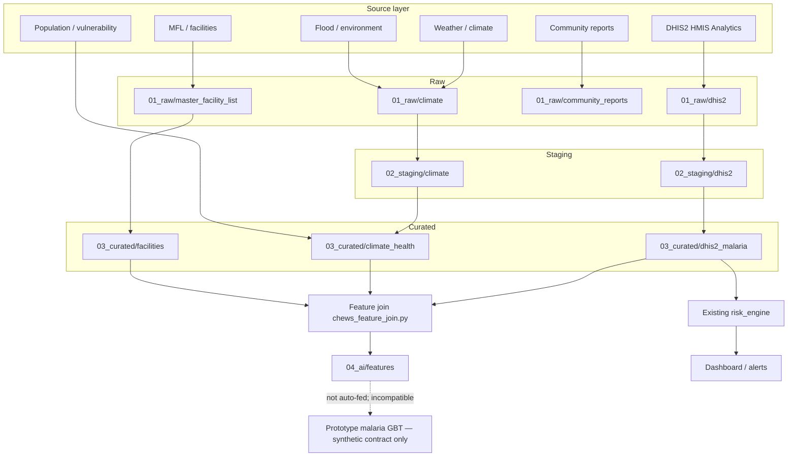

# DHIS2 Analytics integration

CHEWS now includes a **backend-only** Sierra Leone HMIS Analytics ingestion layer. This is an **ingestion and mapping MVP**, not a claim that live national surveillance is production-validated.

DHIS2 is never called from the browser.

---

## What this adds (and what it does not)

| Does | Does not |
| ---- | -------- |
| Pull `/api/analytics` and `/api/organisationUnits` | Retrain or replace the synthetic malaria GBT |
| Store unmodified JSON in `01_raw/dhis2/` | Invent missing values as zero |
| Join Level-5 UIDs to the existing MFL | Create a second facility master |
| Feed `reported_cases` / `trend` into the **existing** `risk_engine.assess()` | Change the risk-engine formula |
| Optionally overlay malaria counts on `/healthcare/forecast/live` when an extract exists | Replace flood/weather/community models |
| Mock mode for local UI | Assume every Level-5 OU is a clinical facility without metadata |

---

## Architecture and data flow

DHIS2 is the **health** source. Climate, flood/environment, population, MFL, and community reports are **separate** source layers. They are not collapsed into one raw schema.



**Schemas**

| Contract | File | Layer |
| -------- | ---- | ----- |
| Raw/normalized Analytics | `dhis2_analytics.schema.json` | health source |
| Organisation unit | `dhis2_organisation_unit.schema.json` | health source |
| Facility↔MFL map | `dhis2_facility_mapping.schema.json` | join |
| Curated malaria health | `dhis2_malaria.schema.json` | curated health |
| Climate (non-DHIS2) | `chews_climate.schema.json` | climate source |
| Environment (non-DHIS2) | `chews_environment.schema.json` | env source |
| Population (non-DHIS2) | `chews_population.schema.json` | population source |
| Joined model features | `chews_malaria_features.schema.json` | downstream |
| Deprecated mixed filename | `dhis2_weekly_epi.schema.json` | `$ref` alias of the feature schema |

`XHQqFqfUfIf` is **malaria_confirmed**, never `malaria_cases`. Periods such as `202509` stay monthly; they are not rewritten as `2025W09`.

Existing lake prefixes (`01_raw`, …) are reused. A second `data/raw/` tree is not created.

---

## Indicator dictionary

Core malaria (queried by default):

| Key | DHIS2 ID | Name | Wide ML table |
| --- | -------- | ---- | ------------- |
| malaria_confirmed | XHQqFqfUfIf | Malaria confirmed (RDT/Microscopy) (sum) | Yes (count) |
| malaria_confirmed_u5 | tjRoHuika9k | Malaria confirmed (RDT/Microscopy) 0-4 years (sum) | Yes (count) |
| malaria_tests | mwrOKePWg2r | Malaria test done at OPD (sum) | Yes (count) |
| malaria_rdt_positive | VWdhdKpLVof | Malaria RDT positive (Facility/Community) | Yes (count) |
| child_malaria_death | MM7wnFwsi7q | % of Child death - Malaria - DPPI-DHAS | Curated nullable field; **not** summed as a count |

Supporting (config only unless `DHIS2_INCLUDE_SUPPORTING=true`):

| Key | DHIS2 ID | Use |
| --- | -------- | --- |
| treatment_within_24h | Al09gOVkmCz | Stored for future use — **not** a prototype model feature |
| testing_coverage | X6rctVtXiAF | Stored for future use — **not** a prototype model feature |

Extend `DHIS2_INDICATORS` / `DHIS2_SUPPORTING_INDICATORS` in `backend/config/dhis2.py`.

---

## Organisation hierarchy (verified SL HMIS)

| Level | Meaning in this instance | Example |
| ----- | ------------------------ | ------- |
| 1 | Sierra Leone | country |
| 2 | District | Western Area Urban District `PMLlCzM0mWT` |
| 3 | Council | Freetown City Council `wlDW6S0pHLL` |
| 4 | Zone | West 3 Zone `RqcjKMD6wRN` |
| 5 | Health facility | Aberdeen Women Centre Hospital `dar4XkzRmN0` |

Geometry is `[longitude, latitude]`. CHEWS does not swap axes and does not invent centroids for non-point geometries.

Level-5 units are treated as facilities only when id + name exist and `level == 5`. Unmapped UIDs (no MFL row) are flagged `unmapped: true`; they keep the DHIS2 id.

---

## Authentication and environment

Copy `.env.example` to `.env` (gitignored). Never put credentials in frontend code or GitHub.

| Variable | Purpose | Default |
| -------- | ------- | ------- |
| DHIS2_BASE_URL | HMIS origin | `https://sl.dhis2.org/hmis23` |
| DHIS2_USERNAME | Basic auth | empty |
| DHIS2_PASSWORD | Basic auth | empty |
| DHIS2_API_TOKEN | Optional `Authorization: ApiToken …` | empty |
| DHIS2_MOCK_MODE | Use bundled fixtures, no network | `true` |
| DHIS2_PERIOD | `LAST_12_MONTHS`, `LAST_12_WEEKS`, `THIS_YEAR`, or `202508,202509` | `LAST_12_MONTHS` |
| DHIS2_OU_DIMENSION | Analytics OU dimension | `LEVEL-5` |
| DHIS2_TIMEOUT_SECONDS | HTTP timeout | 30 |
| DHIS2_RETRIES | Retries on 5xx/429/network | 3 |
| DHIS2_INCLUDE_SUPPORTING | Fetch supporting IDs | false |
| DHIS2_STALE_DAYS | Quality stale flag | 60 |

On Vercel, set the same variables in the project environment — do not upload `.env`.

### Mock mode

```bash
export DHIS2_MOCK_MODE=true
cd backend && uvicorn main:app --reload
curl -s http://127.0.0.1:8000/api/dhis2/status
curl -s -X POST http://127.0.0.1:8000/api/dhis2/ingest
curl -s http://127.0.0.1:8000/api/dhis2/malaria | head
```

Fixtures: `backend/data/01_raw/dhis2/mock/analytics_sample.json` (includes 202509 / `dar4XkzRmN0` / 144 and 100).

### Live DHIS2

```bash
export DHIS2_MOCK_MODE=false
export DHIS2_BASE_URL=https://sl.dhis2.org/hmis23
export DHIS2_USERNAME='your-hmis-user'
export DHIS2_PASSWORD='your-hmis-password'
# or: export DHIS2_API_TOKEN='…'
cd backend && uvicorn main:app --reload
curl -s -X POST http://127.0.0.1:8000/api/dhis2/ingest \
  -H 'Content-Type: application/json' \
  -d '{"period":"LAST_12_MONTHS","ou_dimension":"LEVEL-5"}'
```

Analytics URL pattern:

`/api/analytics?dimension=dx:<ids>&dimension=pe:<periods>&dimension=ou:LEVEL-5`

Period is **not** hardcoded to `LAST_12_MONTHS` only. Returned row periods may be monthly (`202509`) or other DHIS2 calendars — CHEWS does not assume weekly until the extract says so.

---

## API (existing FastAPI dual mount)

| Method | Path | Purpose |
| ------ | ---- | ------- |
| GET | `/api/dhis2/status` | Base URL, mock flag, auth **method** (never secrets) |
| POST | `/api/dhis2/ingest` | Pull + persist lake files |
| GET | `/api/dhis2/malaria` | Long/wide series, overlay, risk-engine mapping |
| GET | `/api/dhis2/facilities` | Mapped org units |
| GET | `/api/dhis2/health-data` | Combined quality + preview |
| GET | `/api/dhis2/risk` | Existing `risk_engine.assess()` with DHIS2 cases + caller climate |
| POST | `/api/dhis2/historical/extract` | Explicit monthly national extract + district-month + completeness |
| POST | `/api/dhis2/historical/climate` | Open-Meteo Archive monthly climate (realtime weather untouched) |
| POST | `/api/dhis2/historical/panel` | Aligned panel + **READY / NOT READY FOR MODEL TRAINING** |
| GET | `/api/dhis2/historical/readiness` | Last verdict |

Same paths without `/api` when talking to local Uvicorn.

---

## Data quality rules

- Missing / blank analytics values stay `null` — **not** 0.  
- Invalid numeric strings flagged; value remains null.  
- Duplicate `(indicator_id, period, org_unit_id)` counted.  
- Negative values on count indicators flagged.  
- Unexpected org-unit level vs requested LEVEL-5 flagged.  
- Unmapped facilities flagged.  
- Monthly reporting gaps listed when periods look like `YYYYMM`.  
- Stale flag if newest YYYYMM is older than `DHIS2_STALE_DAYS`.  

---

## Compatibility with the prototype malaria model and risk engine

**Risk engine (`models/risk_engine.py`)** — interface unchanged:

`assess(rainfall, temperature, humidity, reported_cases, trend, vulnerable_population, exposure_level)`

DHIS2 can supply `reported_cases` (sum of `malaria_confirmed`) and a simple `trend` from the previous period. Climate and exposure are **not** in Analytics; `/api/dhis2/risk` takes climate as query parameters (defaults match the prototype live constants).

**Prototype GBT (`malaria_predictor.py`)** — **not retrained**. It still expects synthetic-era features:

`rainfall_mm, temperature_c, humidity_percent, water_stagnation_index, mosquito_breeding_sites, reported_fever_cases, population_density, district_encoded, …`

DHIS2 does **not** provide those climate/habitat fields. Confirmed malaria is **not** the same as `reported_fever_cases`. Do not silently substitute.

DHIS2-only features (lags, rolling sums, RDT positivity when tests ≠ 0) live in `04_ai/features/` for **future** retraining.

---

## Historical extract and training readiness

Operational `LAST_12_MONTHS` ingest is **not** a training dataset. For a multi-year monthly panel see [DHIS2_ML_DATA_FOUNDATION.md](DHIS2_ML_DATA_FOUNDATION.md):

- `POST /api/dhis2/historical/extract` — explicit YYYYMM (never `LAST_5_YEARS`), facility→district aggregation, completeness
- `POST /api/dhis2/historical/climate` — Open-Meteo **Archive** (not the 24h flood `weather_api`)
- `POST /api/dhis2/historical/panel` — join + `malaria_confirmed_next` + **READY / NOT READY**

Mock fixtures remain 2 months × 1 facility, so the default verdict is **NOT READY FOR MODEL TRAINING**. The synthetic GBT is still not called.

---

## Limitations / known gaps

- No background scheduler; ingest is on-demand (`POST /ingest` or first GET).  
- Serverless (Vercel) will not keep in-memory cache; lake files persist only if the filesystem is durable (often it is not on Vercel). Prefer a VM/container for operational ingest.  
- LEVEL-5 national Analytics payloads can be large and slow.  
- Percentage and count indicators are not mixed in the wide table.  
- Live overlay on forecast/surge runs **only after** a successful ingest; otherwise prototype `_LIVE_SIGNALS` remain.  
- Not clinically or epidemiologically validated.  
- HMIS credentials need a data-sharing agreement; this code does not grant access.
