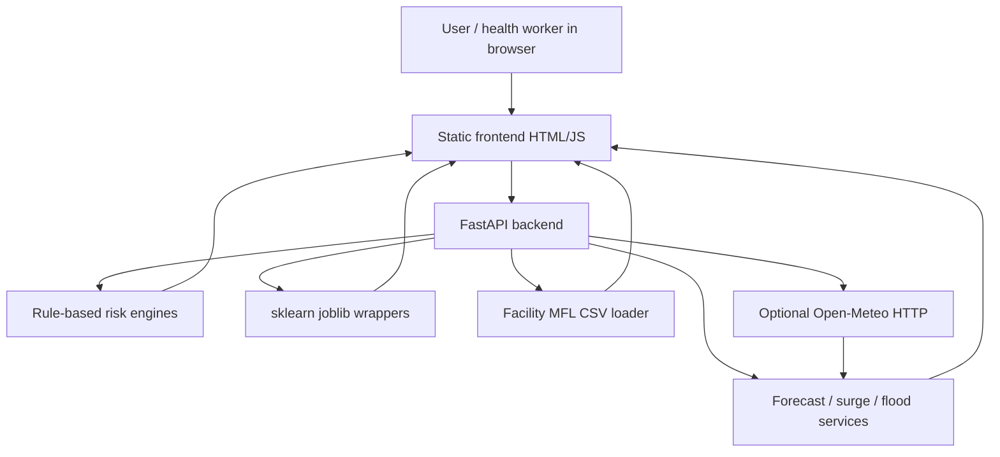
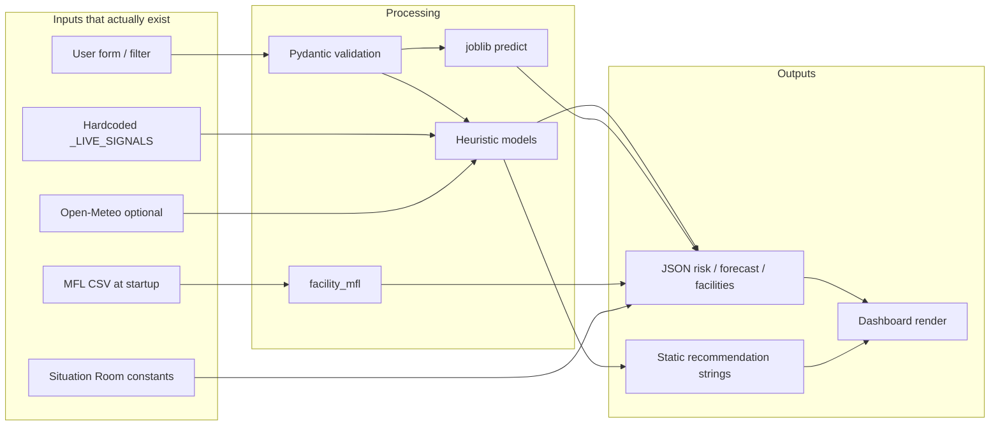
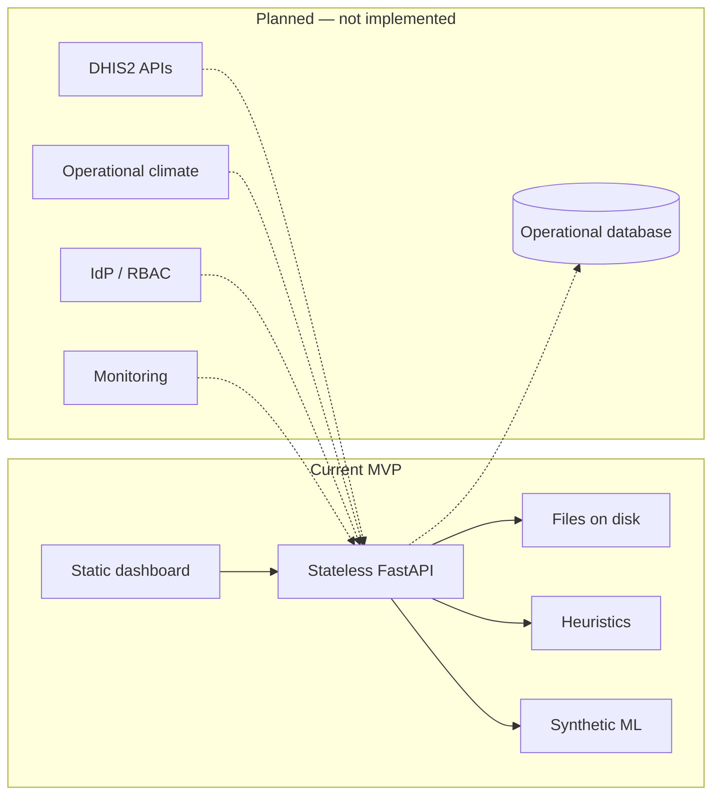
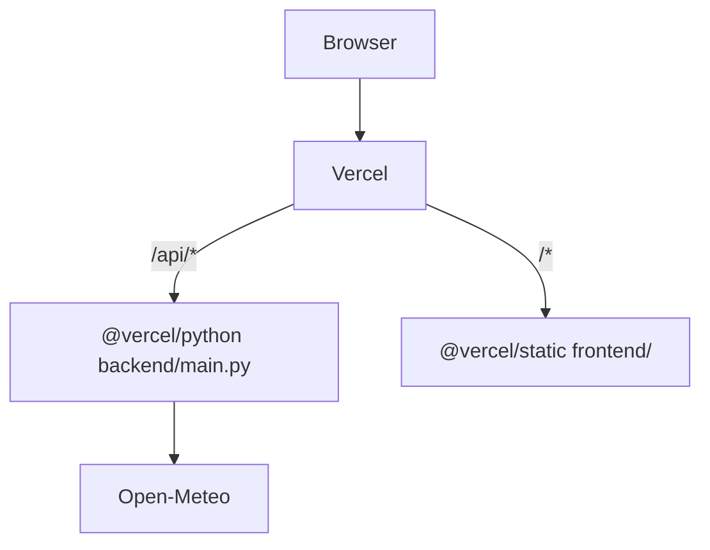

# CHEWS system architecture

**Status of this document:** Describes only components that exist in the repository. Planned integrations are labelled explicitly.

**Application version in code:** FastAPI `version="4.0.0"` (`backend/main.py`).

---

## System overview

CHEWS is a **stateless HTTP prototype**: a browser UI talks to a FastAPI process. There is no application database. Alerts are held in a process-local list. Facility identity is loaded from a CSV at startup. Most “live” dashboard numbers are either rule-engine outputs, synthetic jitter, hardcoded constants, or simulated Situation Room payloads.

---

## Architecture

| Layer | Location | Responsibility |
| ----- | -------- | -------------- |
| Presentation | `frontend/` | Pages, maps, filters, fetch to `/api` |
| API | `backend/main.py` + `backend/routers/` | HTTP, Pydantic validation, CORS |
| Domain scoring | `backend/models/` | Heuristic and sklearn predict functions |
| Services | `backend/services/` | MFL, flood dashboard, alerts, triage, weather |
| Data | `backend/data/` | CSVs, JSON reference, joblib, model cards |
| Hosting config | `vercel.json` | Python for `/api/*`, static files for `frontend/**` |

A second frontend (`frontend-react/`) exists as an unused Vite scaffold. It is **not** part of the deployed architecture.

---

## Components and responsibilities

### FastAPI application (`backend/main.py`)

- Constructs the app, attaches CORS (`allow_origins=["*"]`, `allow_credentials=True`).
- Includes five routers **twice** (prefix `/api` and no prefix).
- On startup, calls `initialize()` on environmental, flood_risk, malaria_predictor, healthcare_readiness, community_reports, and facility_mfl.
- Defines `GET /health`, `GET /api/debug`, `POST /predict`, `POST /ask`.
- Catches import failures into `_import_errors` instead of failing closed.

### Routers

| Module | Prefix | Role |
| ------ | ------ | ---- |
| `routers/strategic.py` | `/strategic` | Vulnerability, hazard map, pollution, carbon, flood atlas, district priorities |
| `routers/early_warning.py` | `/early-warning` | Multi-hazard assess, alert trigger, list alerts |
| `routers/healthcare.py` | `/healthcare` | Forecast, surge, MFL, experimental ML POSTs |
| `routers/point_of_care.py` | `/poc` | Triage, keyword ask, languages, symptoms |
| `routers/situation_room.py` | `/situation-room` | Simulated national command centre |

### Models (scoring)

| Module | Algorithm | Used by |
| ------ | --------- | ------- |
| `risk_engine.py` | Weighted sum of three sub-scores | `POST /predict` |
| `environmental.py` | Rule-based climate suitability; optional GBT trained at startup on synthetic labels from the same rules | risk engine, hazard map |
| `epidemiological.py` | Log-sigmoid case burden + trend multipliers | risk engine |
| `exposure.py` | Categorical exposure + vulnerable-pop mapping | risk engine |
| `flood_risk.py` | Multi-factor heuristic; optional loaded GBT | flood dashboard, early warning |
| `heat_stress.py` | Heuristic WBGT-style scoring | early warning, hazard map |
| `air_quality.py` | Heuristic AQI-style scoring | pollution, early warning |
| `carbon_accounting.py` | Heuristic footprint | `POST /strategic/carbon-footprint` |
| `malaria_predictor.py` | GradientBoostingRegressor joblib or heuristic fallback | `POST /healthcare/ml/malaria-predict` |
| `healthcare_readiness.py` | RandomForestRegressor joblib | `POST /healthcare/ml/readiness-predict` |
| `community_reports.py` | RandomForestClassifier joblib (blocked by model card) | `POST /healthcare/ml/community-flood` |

### Services

| Module | Role | Data honesty |
| ------ | ---- | ------------ |
| `facility_mfl.py` | Load MoH DHIS2 core facilities CSV; district from code prefix; type from name | Does not invent beds/staff/power |
| `forecast_engine.py` | Seasonal-climatological “forecast-in-a-box” | Explicitly rule-based; no time-series DB |
| `flood_dashboard.py` | Zone scores + optional Open-Meteo | Synthetic jitter if weather fetch fails |
| `weather_api.py` | Open-Meteo precipitation, 1h in-memory cache, 2s timeout | **Partial** live weather |
| `alert_engine.py` | Thresholds → in-memory alert list | Lost on process restart |
| `triage_assistant.py` | Symptom point scores + translations | Not a clinical protocol engine |
| `vulnerability.py` | Facility/community vulnerability composite | User-supplied or default inputs |

### Frontend

Static pages in `frontend/` (login, command centre, healthcare, early warning, strategic, point of care, CHW, partner, district, AI models, report). Shared `auth.js` (role in `localStorage`), `theme.js` (OSM basemap), `styles.css`.

### Data store

Files on disk. No PostgreSQL, SQLite, or object store client in application code.

---

## Data flow (implemented)

**Healthcare Forecast / Surge (dashboard path)**

1. Page loads `healthcare.html`; `healthcare.js` polls `GET /api/healthcare/forecast/live` and `/surge/live` (area/disease query params).  
2. Router reads `_LIVE_SIGNALS` (fixed rainfall, temperature, humidity, case counts per disease).  
3. `forecast_engine.forecast_disease` applies seasonal rules.  
4. Surge uses MFL **counts** vs forecast caseload — not fabricated bed occupancy.

**`/predict` path**

1. Client posts climate + cases + exposure.  
2. `risk_engine.assess` calls environmental, epidemiological, exposure.  
3. `final = 0.4*env + 0.4*epi + 0.2*exp`.  
4. Level + explanation + recommendation lists returned.

---

## Backend architecture

- **Framework:** FastAPI ASGI.  
- **Validation:** Pydantic v2 `Field` constraints on most bodies.  
- **Error handling:** Mixed. Some routes raise `HTTPException` (e.g. missing facility). Import errors are swallowed into `_import_errors`. `/api/debug` returns those errors to any caller.  
- **Logging:** `print` statements; no structured logger.  
- **Background jobs:** None.  
- **External HTTP:** Open-Meteo from `weather_api.py` only (as used by `flood_dashboard.py`).

---

## Frontend architecture

- **No SPA framework** in the deployed UI. Each HTML page loads its own JS file.  
- **Maps:** Leaflet + OSM; MarkerCluster on the facility map.  
- **Auth UX:** `login.html` writes `chews-role` and optional `chews-district`. `requireRole()` redirects only if role is missing; `getRole()` **defaults to `admin`**. This is not access control.  
- **Hardcoded KPIs:** Several overview numbers in HTML (e.g. command-centre style metrics) are **static markup**, not `/predict` results. `report.html` is a static bulletin.  
- **Responsive:** Shared breakpoints in `styles.css`.

---

## AI/ML architecture

Two parallel tracks:

1. **Always-on heuristics** for `/predict`, forecast-in-a-box, flood/heat/AQI, triage.  
2. **Optional sklearn** loaded from `backend/data/trained_models/*.joblib` (duplicates exist under `04_ai/models/`). Environmental GBT is **trained in-process at startup** on synthetic X with labels from the rule engine — it cannot outperform those rules on the generating process.

See [AI_ML_METHODOLOGY.md](AI_ML_METHODOLOGY.md).

---

## External integrations

| System | Status | Evidence |
| ------ | ------ | -------- |
| Open-Meteo | **Partially implemented** | `services/weather_api.py` called from `flood_dashboard._district_signal` |
| MoH DHIS2 Master Facility List | **Implemented as a static CSV extract** | `moh_dhis2_core_health_facilities.csv`; not a live DHIS2 API |
| DHIS2 aggregate/analytics API | **Not implemented** | No DHIS2 client; `dhis2_malaria_chews_v1.csv` is synthetic |
| SMS / email / push alerts | **Not implemented** | In-memory list only |
| Sensor networks | **Not implemented** | `situation_room.py` hardcodes mock sensors |
| LLM providers | **Not implemented** | Keyword dictionaries in `main.py` and `point_of_care.py` |

### Planned / future (not in code)

- Live DHIS2 malaria and notifiable-disease extracts  
- Sierra Leone MFL operational indicators (beds, staffing, commodities) without fabricating gaps  
- Operational weather/climate (beyond optional Open-Meteo rainfall)  
- Community health worker report ingestion  
- Geospatial analysis beyond Leaflet + district GeoJSON + flood-zone JSON  
- Facility surveillance time series for true forecasting

---

## Current vs planned architecture

---

## Security boundaries

There is **no trust boundary** between anonymous internet clients and scoring/MFL APIs. The only “boundary” is CORS (currently open) and the Vercel route split (`/api` vs static). Client-side roles do not bind the API. Details: [SECURITY.md](SECURITY.md).

---

## Deployment architecture

Local development is two processes (Uvicorn + static server) unless a proxy is added. There is no Docker, no CI workflow, and no pinned Python runtime file in the repository.

See [DEPLOYMENT.md](DEPLOYMENT.md).
